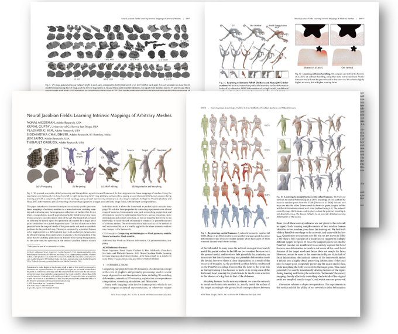
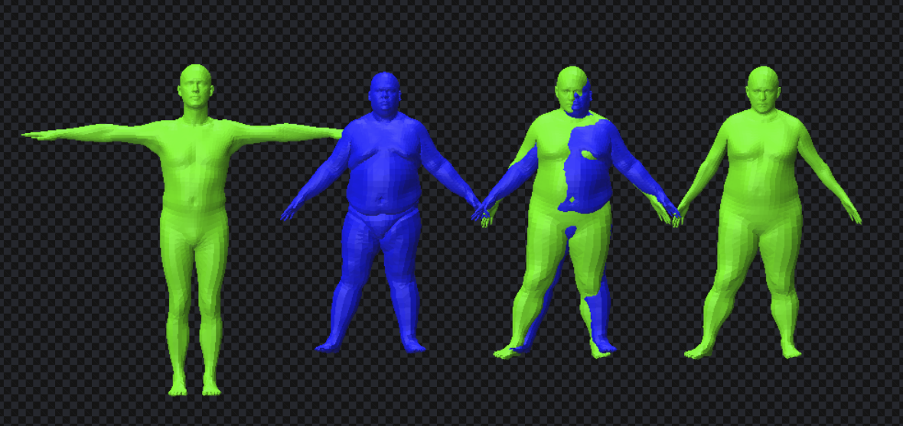

## NJF  [[Paper]](https://arxiv.org/abs/2205.02904)([Tweet)](https://twitter.com/AigermanNoam/status/1524433177929940992?s=20&t=i__gwz_kGGVt67crBJpFVg)

**Neural Jacobian Fields: Learning Intrinsic Mappings of Arbitrary Meshes** <br>
N. Aigerman, K. Gupta, V. G. Kim, S. Chaudhuri, J. Saito, T. Groueix <br>
In [SIGGRAPH, 2022](https://s2022.siggraph.org/).



#  TLDR

NJF is a neural network architecture that can deform a mesh into another mesh. Its most remarkable strenght is that to be agnostic to triangulation *i.e.* you will get exactly the same result if you remesh your shapes.


NJF is  a  general  approach. To train, you need a folder of meshes, and a list of training pairs (source, target) indexing this folder. NJF can learn parameterization, registration, morphing, ARAP deformations... Please see the paper for the full list of application we explored.

# Install

```shell
conda create -y -n py39_njf python=3.9
conda activate py39_njf
pip3 install torch torchvision  --extra-index-url https://download.pytorch.org/whl/cu113
conda install -y -c conda-forge igl
pip install trimesh pytorch_lightning matplotlib easydict cholespy fire
pip install torch-scatter torch-sparse -f https://data.pyg.org/whl/torch-1.12.1+11.3.html
# or if on MAC : pip install torch-scatter torch-sparse -f https://data.pyg.org/whl/torch-1.12.1+cpu.html
```

# Inference

We provide pretrained weights and a demo script, using [Polyscope](https://polyscope.run/) (`python -m pip install polyscope`).


```
python demo_scripts/demo_morph_any_shape_into_any_other.py -with_WKS 0 -source_mesh ./data/source.obj -target_mesh ./data/target.obj
```


*From left to right : template, target, overlay of target and morphed template, morphed template.*


We have an example training script using the FAUST dataset. It's a good starting point for your own application.

# Training
```
python training_scripts/script_train_default.py
```
To train on your own data, create a folder of meshes and a json file in that folder called "data.json" containing the (source,target) pairs. Note that, for each pair, the source and target should be in dense correspondences. For instance, if your application is morphing a  "template.obj" into other shapes "001.obj", ... "999.obj", then your folder should look like:
```
training_database
|-template.obj
|-001.obj
|- ...
|-999.obj
```
and your data.json

```
{
"pairs": [
        [
            "template.obj",
            "001.obj"
        ],
        [
            "template.obj",
            "002.obj"
        ],
        ...
    ]
}
```
The code supports generating [STAR](https://github.com/ahmedosman/STAR) (next-gen SMPL) human meshes on the fly, with various features. To use this, you'll need to install STAR and use the flag `-compute_human_data_on_the_fly`. Follow this additional set of instruction [star_on_the_fly_install](./STAR_INSTALL.md)

### Training options

The most important flags are listed below.
See [args_from_cli.py](./args_from_cli.py) for a full list.

* `root_dir_train` : location of the root dir to get data from
* `root_dir_test` : location of the root dir to get data from
* `no_wks` : don't use WKS features. If your data is not clean, you might not be able to compute WKS features.
* `experiment_type` : add specific feature depending on the type of experiment. Options are {"TPOSE","REGISTER_TEMPLATE","DEFAULT"}.

### Citing this work

```
@article{aigerman2022neural,
  title={Neural Jacobian Fields: Learning Intrinsic Mappings of Arbitrary Meshes},
  author={Aigerman, Noam and Gupta, Kunal and Kim, Vladimir G and Chaudhuri, Siddhartha and Saito, Jun and Groueix, Thibault},
  journal={SIGGRAPH},
  year={2022}
}
```
